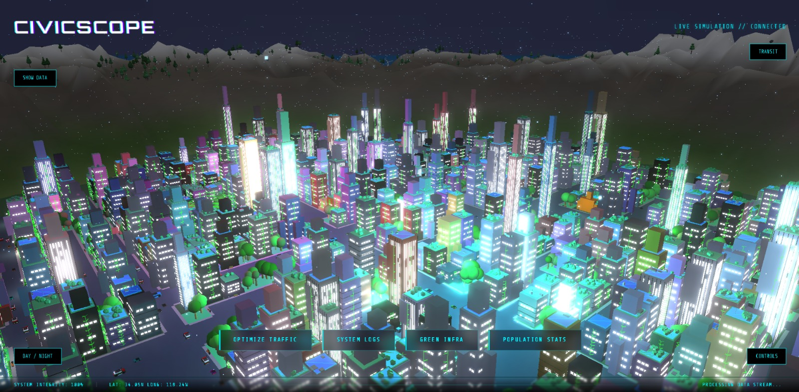
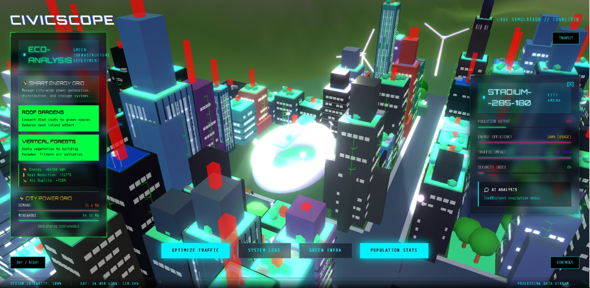

# 🏛 CIVIC.SCOPE  
**Interactive 3D city simulation for sustainable urban planning**

  

  

  

  

  

  

  

  

---

## 🌐 Overview

CivicScope is an interactive 3D city simulation platform designed to support
the exploration of sustainable urban planning decisions. It enables users to
visualize how changes in urban design, transportation, zoning, energy systems,
and policy choices affect city-scale sustainability outcomes in real time.

The platform is built using procedural generation and a Three.js–based rendering
engine, with a strong focus on clarity, performance, and extensibility. This
design provides the following benefits:

- **Interactivity:** Urban parameters can be adjusted dynamically, with immediate
  visual feedback across the simulated city.
- **Scalability:** Procedural techniques allow simulations to scale from small
  districts to large urban environments.
- **Comprehensibility:** Real-world sustainability metrics are presented through
  intuitive visual representations.

CivicScope aims to make complex urban systems easier to understand by combining
data-driven simulation with accessible 3D visualization.

---

## ❗ Problem
> [!IMPORTANT]
> Modern cities often prioritize growth and capital over sustainability, leading to:

- 🌫️ High pollution and emissions  
- 🚗 Traffic congestion and inefficient layouts  
- 🧠 Low public understanding of urban planning  
- 📉 Abstract, hard-to-visualize data  

---

## 💡 Solution

**CivicScope** transforms urban planning into a **visual and interactive experience**, allowing users to explore cities and instantly see the impact of their decisions.

---

## 🚀 Key Features

- 🗺️ **Procedural City Generation** – unique, randomly generated realistic cities every run  
- 🌎 **3D Exploration** – fully navigable cities powered by Three.js  
- 📊 **Interactive Data Layers** – clickable buildings and toggles for clear metrics based on real world data create accessible and easily understandable data
- 📍 **Transit Simulation** – generate optimized bus, rail, and metro networks
- 🌦️ **Dynamic Weather & Day/Night Cycles** – Creates a more complete and immersive simulation
- 🎯 **Real-World Accuracy** – grounded in real sustainability data used to measure and quantify urban planning in cities all across the world
- 🤖 **AI Assisted Analysis** – our project uses Artificial Intelligence to serve the data and to make it more easily digestible

---

---

## 🔴 LIVE DEMO

Access the live demo of our project here: 
> [!IMPORTANT]
> 🔗 **Live Demo**  
> https://stupendous-llama-651516.netlify.app/  
>
> 🎥 **Video Demo**  
> https://youtu.be/z4-jg1b5h8M

---

## 👨‍💻 Developers

- Owen : AI Developer & Fullstack Developer
- Kennard : Fullstack Developer
- Edgar : Frontend Developer
- Dave : UI/UX Designer

---

## 🔧Tech Stack
- Frontend: HTML, CSS, ThreeJs, Javascript
- AI: OpenAI API (ChatGPT)
- Deployment: Netlify

---

## 🔮 Future Plans

- 🤖  More accurate AI-based city evaluation 
- 🏗️  Custom city creation tools to allow the users the freedom to create  
- 📈  Deeper sustainability and infrastructure data  
- 🏘️  Create a more immersive experience 
---

## 📋 Liscence 
This project is licensed under the MIT License.
---
